<!-- migration-assessment
  solution: Facesso
  generated: 2026-03-06T22:34:29Z
  skill-version: 1.0
  document: 05-architecture-diagram
-->

# Facesso — Architecture & Project Topology

## Solution Structure

```
Facesso.sln (17 projects, .NET Framework 4.7.2)
├── Facesso/                     [WinExe]  Main MDI shell application
├── FacessoConfig/               [WinExe]  Database/license configuration utility
├── FacessoSerialGenerator/      [WinExe]  License serial number generator
├── FacessoData/                 [DLL]     Core data access layer (SPAccess pattern)
├── FacFunctions/                [DLL]     Business logic, dialogs, reports (~82 VB files)
├── FAC_Generic/                 [DLL]     Singleton hub: config, licensing, login, state
├── FacInterfaces/               [DLL]     External system import interfaces
├── FacGenericControls/          [DLL]     Application-specific UI controls
├── Fac_EntityModel/             [DLL]     Entity Framework 6 EDMX model (minimal use)
├── Controls/                    [DLL]     ADNullableValueControls (nullable UI controls)
├── ADDataTypes/                 [DLL]     Core data types, enums, expression parser
├── ADInfoItem/                  [DLL]     Entity base classes (InfoItemsBase)
├── ADLicenceManager/            [DLL]     License validation framework
├── ADSimplePrintDocument/       [DLL]     Print document abstraction (C#)
├── ADSqlSupportComponents/      [DLL]     SQL connection UI components
├── ADSundries/                  [DLL]     Utilities: crypto, WMI, wizard, reflection
└── ActiveDevelop.SqlTools/      [DLL]     Database schema management base

Separate Solutions (not in main .sln):
├── Database/FacessoDB/          [SQLPROJ] SQL Server Database Project (28 tables, 80 SPs)
└── HoloLens/Facesso.HoloLens.Mock/ [UWP] Experimental HoloLens client (isolated)
```

## Project Dependency Graph

```mermaid
graph TD
    subgraph "UI Layer"
        Facesso["Facesso.exe<br/>(Main Shell)"]
        FacessoConfig["FacessoConfig.exe<br/>(Config Utility)"]
        SerialGen["ADSerialGenerator.exe<br/>(License Tool)"]
    end

    subgraph "Business Logic Layer"
        FacFunctions["Fac_Functions<br/>(Business Logic + Dialogs)"]
        FacInterfaces["FacInterfaces<br/>(Import Interfaces)"]
    end

    subgraph "Data Access Layer"
        FacData["Fac_Data<br/>(SPAccess DAL)"]
        FacEntityModel["Fac_EntityModel<br/>(EF6 EDMX)"]
    end

    subgraph "Core Services"
        FacGeneric["FAC_Generic<br/>(Singleton Hub)"]
    end

    subgraph "UI Control Libraries"
        FacGenericControls["Fac_GenericControls<br/>(App UI Controls)"]
        ADNullableControls["ADNullableValueControls<br/>(Nullable Input Controls)"]
    end

    subgraph "Infrastructure Libraries (ActiveDevelop.*)"
        ADDataTypes["ADDataTypes<br/>(Core Types)"]
        ADInfoItem["ADInfoItem<br/>(Entity Base)"]
        ADLicence["ADLicenceManager<br/>(Licensing)"]
        ADPrint["ADSimplePrintDocument<br/>(Printing, C#)"]
        ADSqlSupport["ADSqlSupportComponents<br/>(SQL Connection UI)"]
        ADSundries["ADSundries<br/>(Utilities)"]
        ADSqlTools["ActiveDevelop.SqlTools<br/>(Schema Mgmt)"]
    end

    subgraph "Database"
        SQLDB[("SQL Server<br/>28 Tables, 80 SPs<br/>4 Triggers, 9 Functions")]
    end

    %% Main App dependencies
    Facesso --> FacFunctions
    Facesso --> FacData
    Facesso --> FacGeneric
    Facesso --> FacGenericControls
    Facesso --> FacEntityModel
    Facesso --> ADNullableControls
    Facesso --> ADDataTypes
    Facesso --> ADInfoItem
    Facesso --> ADLicence
    Facesso --> ADSqlSupport
    Facesso --> ADSundries
    Facesso --> ADSqlTools

    %% Config App dependencies
    FacessoConfig --> FacGeneric
    FacessoConfig --> ADSqlSupport

    %% Serial Generator
    SerialGen --> ADLicence
    SerialGen --> ADSundries

    %% Business Logic Layer
    FacFunctions --> FacData
    FacFunctions --> FacGeneric
    FacFunctions --> FacGenericControls
    FacFunctions --> FacEntityModel
    FacFunctions --> ADNullableControls
    FacFunctions --> ADDataTypes
    FacFunctions --> ADInfoItem
    FacFunctions --> ADLicence
    FacFunctions --> ADPrint
    FacFunctions --> ADSundries

    FacInterfaces --> FacData
    FacInterfaces --> FacGeneric
    FacInterfaces --> ADSundries

    %% Data Access Layer
    FacData --> ADDataTypes
    FacData --> ADInfoItem
    FacData --> ADSqlSupport
    FacData --> FacGeneric
    FacData --> ADSundries
    FacData --> ADSqlTools

    FacEntityModel --> SQLDB

    %% UI Controls
    FacGenericControls --> FacData
    FacGenericControls --> FacGeneric
    FacGenericControls --> ADDataTypes
    FacGenericControls --> ADInfoItem
    FacGenericControls --> ADNullableControls
    FacGenericControls --> ADSundries

    %% Infrastructure interdependencies
    ADLicence --> ADSundries
    ADSqlSupport --> ADSundries
    FacGeneric --> ADLicence
    FacGeneric --> ADSundries
    FacGeneric --> ADDataTypes

    %% Database connections
    FacData --> SQLDB
    FacGeneric --> SQLDB

    %% Styling
    classDef exe fill:#e74c3c,stroke:#c0392b,color:white
    classDef dll fill:#3498db,stroke:#2980b9,color:white
    classDef infra fill:#2ecc71,stroke:#27ae60,color:white
    classDef db fill:#f39c12,stroke:#e67e22,color:white
    classDef ui fill:#9b59b6,stroke:#8e44ad,color:white

    class Facesso,FacessoConfig,SerialGen exe
    class FacFunctions,FacInterfaces,FacData,FacEntityModel,FacGeneric dll
    class ADDataTypes,ADInfoItem,ADLicence,ADPrint,ADSqlSupport,ADSundries,ADSqlTools infra
    class ADNullableControls,FacGenericControls ui
    class SQLDB db
```



## Subsystem Grouping

### Subsystem 1: Application Shell
| Project | Type | Language | Framework | Role |
|---------|------|----------|-----------|------|
| Facesso | WinExe | VB.NET | 4.7.2 | Main MDI host, toolbars, navigation |
| FacessoConfig | WinExe | VB.NET | 4.7.2 | Standalone configuration utility |
| ADSerialGenerator | WinExe | VB.NET | 4.7.2 | Internal license key tool |

### Subsystem 2: Business Logic
| Project | Type | Language | Framework | Role |
|---------|------|----------|-----------|------|
| Fac_Functions | DLL | VB.NET | 4.7.2 | All business forms, dialogs, reports, print classes |
| FacInterfaces | DLL | VB.NET | 4.7.2 | External system import adapters |

### Subsystem 3: Data Access
| Project | Type | Language | Framework | Role |
|---------|------|----------|-----------|------|
| Fac_Data | DLL | VB.NET | 4.7.2 | SPAccess classes (sole DB gateway for CRUD) |
| Fac_EntityModel | DLL | VB.NET | 4.7.2 | EF6 EDMX model (parallel/unused) |

### Subsystem 4: Core Services
| Project | Type | Language | Framework | Role |
|---------|------|----------|-----------|------|
| FAC_Generic | DLL | VB.NET | 4.7.2 | Application singleton: config, login, licensing, settings |

### Subsystem 5: UI Controls
| Project | Type | Language | Framework | Role |
|---------|------|----------|-----------|------|
| Fac_GenericControls | DLL | VB.NET | 4.7.2 | Domain-specific ListView, DateRange, DataGrid controls |
| ADNullableValueControls | DLL | VB.NET | 4.7.2 | Generic nullable-aware input controls |

### Subsystem 6: Infrastructure (ActiveDevelop.*)
| Project | Type | Language | Framework | Role |
|---------|------|----------|-----------|------|
| ADDataTypes | DLL | VB.NET | 4.7.2 | ADDBNullable, enums, expression parser |
| ADInfoItem | DLL | VB.NET | 4.7.2 | InfoItemsBase entity base class |
| ADLicenceManager | DLL | VB.NET | 4.7.2 | License validation and anti-tampering |
| ADSimplePrintDocument | DLL | **C#** | 4.7.2 | Printing abstraction |
| ADSqlSupportComponents | DLL | VB.NET | 4.7.2 | SQL connection dialogs |
| ADSundries | DLL | VB.NET | 4.7.2 | Crypto, WMI, wizard framework, utilities |
| ActiveDevelop.SqlTools | DLL | VB.NET | 4.7.2 | Database schema update manager |

## UI Framework Matrix

| UI Framework | Project Count | Modern Target | Migration Path | Complexity |
|-------------|--------------|---------------|----------------|------------|
| WinForms | 16 (all VB.NET projects) | WinForms on .NET 8+ | Retarget → SDK-style project → .NET 8+ | Medium |
| WPF interop | 2 (Facesso, ADInfoItem have UseWPF=true) | WPF on .NET 8+ or remove if unused | Verify actual WPF usage; likely just flag | Low |
| UWP | 1 (HoloLens.Mock — separate solution) | WinUI 3 / MAUI | Separate effort; isolated from main migration | N/A |

## Framework-Per-Project Matrix

| Project | Framework | SDK-Style? | Output | Language | Option Strict | Assembly Signed |
|---------|-----------|-----------|--------|----------|---------------|-----------------|
| Facesso | net472 | No | WinExe | VB.NET | On | Yes (ActiveDev.pfx) |
| FacessoConfig | net472 | No | WinExe | VB.NET | On | — |
| ADSerialGenerator | net472 | No | WinExe | VB.NET | On | — |
| Fac_Data | net472 | No | Library | VB.NET | On | Yes |
| Fac_Functions | net472 | No | Library | VB.NET | On | Yes |
| FAC_Generic | net472 | No | Library | VB.NET | On | Yes |
| FacInterfaces | net472 | No | Library | VB.NET | On | Yes |
| Fac_GenericControls | net472 | No | Library | VB.NET | On | Yes |
| Fac_EntityModel | net472 | No | Library | VB.NET | On | — |
| Controls | net472 | No | Library | VB.NET | On | Yes |
| ADDataTypes | net472 | No | Library | VB.NET | On | Yes |
| ADInfoItem | net472 | No | Library | VB.NET | On | Yes |
| ADLicenceManager | net472 | No | Library | VB.NET | On | Yes |
| ADSimplePrintDocument | net472 | No | Library | **C#** | N/A | Yes |
| ADSqlSupportComponents | net472 | No | Library | VB.NET | On | Yes |
| ADSundries | net472 | No | Library | VB.NET | On | Yes |
| ActiveDevelop.SqlTools | net472 | No | Library | VB.NET | On | Yes |

## Key Architectural Observations

1. **Load-Bearing Projects:** `FAC_Generic` (referenced by 10+ projects) and `ADDataTypes` / `ADSundries` (foundational types) — these determine migration order.

2. **Circular Dependencies:** None detected. The dependency graph is a clean DAG.

3. **Central Bottleneck:** `FacessoGeneric` module in `FAC_Generic` acts as a service locator / god object — holds connection string, login state, settings, licensing, and subsidiary info. Every project depends on it.

4. **Mixed Language:** Only `ADSimplePrintDocument` is C#; all others are VB.NET. This simplifies VB→C# conversion planning (one project already done).

5. **No Shared Projects or Directory.Build.props:** Each project independently defines its settings. SDK-style conversion will require creating shared build infrastructure.
